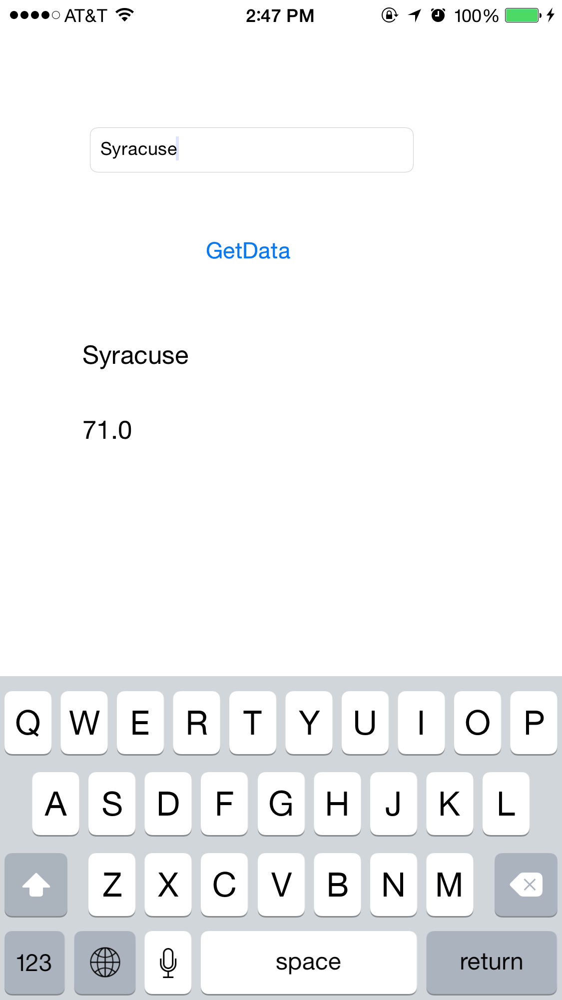

Weather
=====================
use UIActivityIndicatorView
read json from 
http://api.openweathermap.org/data/2.5/weather?q=Syracuse,NY

Screenshot
==========

Sample code
-----------
    func getWeatherData( urlString : String){
        
        self.loadingIndicator.hidden = true
        self.loadingIndicator.stopAnimating()
        
        
        let url = NSURL(string: urlString)
        
        
        let task = NSURLSession.sharedSession().dataTaskWithURL(url!){(data,response,error) in
            dispatch_async(dispatch_get_main_queue(), {
                self.setLabels(data)
            })
        }
        task.resume()
    }
    
    func setLabels(weatherData: NSData){
        
        
        var jsonError : NSError?
        let json  = NSJSONSerialization.JSONObjectWithData(weatherData, options: nil, error: &jsonError) as! NSDictionary
        
        if let name = json["name"] as? String{
            cityName.text = name
        }
        
        if let main = json["main"] as? NSDictionary{
            if let temp = main["temp"] as? Double{
                var temperature = round(((temp - 273.15) * 1.8) + 32)
                cityTemp.text = String(format: "%.1f", temperature)
            }
        }else{
            cityTemp.text = "Weather is unavailable."
        }
    }

